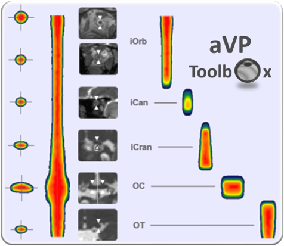

# The aVP-Toolbox project

v0.11, 12-2023

Emanuele Pravatà
Neurocenter of Southern Switzerland
emanuele.pravata@eoc.ch

## Background
MRI has been employed by a multitude of scientific projects and clinical applications for conducting studies and extracting morphometric biomarkers concerning the brain and, more recently, the spinal cord. In particular, the availability of standardized methods for extracting metrics, and methodological frameworks for making comparisons across populations, has enabled the advancement of disease knowledge, and promises to facilitate the personalization of prognosis and therapeutic decision-making for many people with neurological disorders, such as multiple sclerosis, neurodegenerative diseases, and brain tumors, to name but a few.

## Aim
The aVP-Toolbox project proposes an innovative dedicated methodology to allow morphometric MRI analysis of the whole anterior visual pathway (aVP). It aims at  a) advance the in-vivo knowledge of the aVP structure by MRI, b) define a standardized common anatomical space to allow interindividual comparison, and the conduct of group and multiparametric studies, and c) provide tools for the extraction of morphometry biomarkers of the entire anterior optic pathway, including the nerve, the chiasm and the optic tract. A tool for automatic segmentation is currently being developed. aVP-Toolbox uses a combination of original Matlab scripts, Bash and FSL (FMRIB) tools.
This project continues the development of a methodological framework for the high-resolution study of aVP by MRI, which began with the development of the STIR-ZOOMit MRI sequence (see Pravatà E, et al., Dedicated 3D-T2-STIR-ZOOMit Imaging Improves Demyelinating Lesion Detection in the Anterior Visual Pathways of Patients with Multiple Sclerosis. AJNR Am J Neuroradiol. 2021 Jun;42(6):1061-1068). STIR-ZOOMit is a novel "small FOV" 3-D MRI sequence that obtains sub-millimeter and high contrast resolution images of the aVP, facilitating the detection of small lesions compared with conventional 2-D imaging.

 
## Features
aVP-Toolbox is under development, and currently offers the following features (version 0.1, 12-2023):
- Extraction of the volume, length, cross-section area (CSA), minor and major axis of the intraorbitary, intracanalicular and intracranial divisions of the optic nerve, chiasm and optic tract.
- Normalization of the segmentations of the aVP according to its longitudinal axis, with preservation of the nerve CSA.
- Generation of customized probabilistic templates of the entire aVP and the corresponding anatomical subdivisions.

A copy of the probabilistic atlas "aVP-24" generated by 24 healthy volunteers from 3T-MRI images, and the normalized segmentations of the optical pathways used to build it, are available in compressed nifti format in this repository.

## MRI data and software requirements
Currently, aVP-Toolbox requires already drawn segmentations of the aVP, along with an a priori labelling of the anatomical subdivision for each subject. It requires segmentations drawn from axial-oriented images of 0.6mm3 voxel size. Please avoid images that are not perfectly oriented in the axial orthogonal plane and are not isotropic. All images of different subjects should be the same size. 
A tool for automatic segmentation is currently being developed. aVP-Toolbox uses a combination of original Matlab scripts, Bash and FSL (FMRIB) tools.
Please see the instructions documentation in this repository for more details, and refer to the publication “Pravatà, E., Diociasi, A., Navarra, R. et al. Biometry extraction and probabilistic anatomical atlas of the anterior Visual Pathway using dedicated high-resolution 3-D MRI. Sci Rep 14, 453 (2024). https://doi.org/10.1038/s41598-023-50980-x” for more methodological details.

## Copyright and credits
aVP-Toolbox is a non-profit project developed at the Neurocenter of Southern Switzerland in Lugano (CH) under the direction of Emanuele Pravatà (PD, MD), and in collaboration with Prof. Luca Roccatagliata and Dr. Andrea Diociasi, (DISSAL- Dipartimento di Scienze della Salute, University of Genoa, IT), PhD Riccardo Navarra (Institute for Advanced Biomedical Technologies-ITAB,Chieti, IT), and PhD Paul Summers (IEO-European institute of Oncology, Milan, IT). 

## Acknowledgements.
This project was conducted with financial support from: 'Velux Stiftung', 'Swiss Society of Multiple Sclerosis', and 'Advisory Board for Research of the Ente Ospedaliero Cantonale del Ticino (ABREOC)'.

## Licence
AVP-Toolbox is licensed under the Creative Commons Attribution 4.0 International License, permitting use, sharing, adaptation, distribution and reproduction in any medium or format, as long as you give appropriate credit to the original author(s) and the source, provide a link to the Creative Commons licence, and indicate if changes were made. The licensor offers the Licensed Material as-is and as-available, and makes no representations or warranties of any kind concerning the Licensed Material, whether express, implied, statutory, or other. This includes, without limitation, warranties of title, merchantability, fitness for a particular purpose, non-infringement, absence of latent or other defects, accuracy, or the presence or absence of errors, whether or not known or discoverable. Where disclaimers of warranties are not allowed in full or in part, this disclaimer may not apply to You. Please go to http://creativecommons.org/licenses/by/4.0/ to view a complete copy of this licence. 

## Instructions
For instructions on using the aVP toolbox software, please read the document "**/code/v0.11/aVP_instructions_v0.11.txt**" in this repository.

## References
*If you cite aVP-Toolbox in your research of as part of your projects, we kindly ask you to cite the following reference:*

Pravatà, E., Diociasi, A., Navarra, R. et al. Biometry extraction and probabilistic anatomical atlas of the anterior Visual Pathway using dedicated high-resolution 3-D MRI. Sci Rep 14, 453 (2024). https://doi.org/10.1038/s41598-023-50980-x
